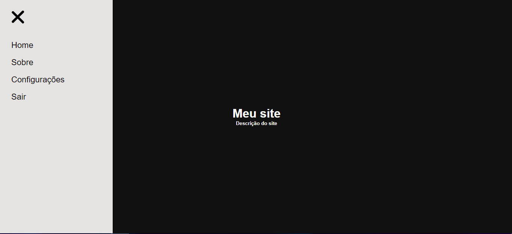

# Projeto menu hamburguer - Básico

Projeto básico construído a partir do vídeo disponibilizado pelo Bonieky Lacerda

🔗 [Clique aqui para acessar](https://kaiojesus.github.io/Menu-hamburguer)

## 🛠 Tecnologias
- HTML
- CSS
- Git e GitHub

## ✉ Contato

kaiojesus41@gmail.com

